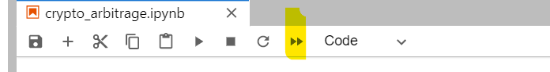

# Project Title

The Real Estate Analysis application is a python jupyter lab interface program.  It collects data from csv files and provides visual interactive plots for user's analysis.


---

## Technologies

This project leverages python 3.7 with the following packages:

* [Jupyter Notebook](https://jupyter-notebook-beginner-guide.readthedocs.io/en/latest/what_is_jupyter.html) - It's a server-client application that allows editing and running notebook documents via a web browser.

* [pandas](https://pandas.pydata.org/pandas-docs/stable/index.html) - For Series, DataFrame, and plots

* [pathlib](https://docs.python.org/3/library/pathlib.html) -For object-oriented filesystem paths 

* [hvplot](https://hvplot.holoviz.org/user_guide/Introduction.html) - For a high-level plotting API built on HoloViews and Bokeh that provides a general and consistent API for plotting data in all the abovementioned formats.

---


## Installation Guide

Before running the application first install the following dependencies.

```python
  pip install pandas
  pip install jupyterlab
  conda install -c pyviz hvplot geoviews
```

To use the loan qualifier app, simply clone the `financial_panner' from the respository, open jupyter lab and open **real_estate_analysis.ipynb** with:

```python
jupyter lab
```

After launching the real_estate_analysis in jupyter notebook, then re-run the jupyter book to produce the dataframe data and hvplots.



---

## Contributors

Brought to you by FinTech Material and Eunice

---

## License

MIT